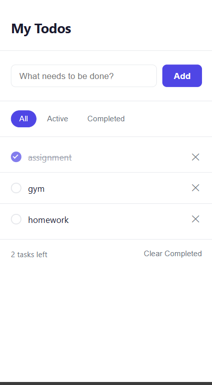

# Todo App

A clean, minimal todo list app built with pure HTML, CSS, and vanilla JavaScript.

🔗 **Live Demo:** https://shreyash-bhimte.github.io/todo-app

## Features

- Add todos by typing and pressing Enter or clicking Add
- Mark todos as complete with a single click
- Delete individual todos
- Filter by All / Active / Completed
- Clear all completed todos at once
- Remaining active task count
- Empty state messages per filter
- Data persists across page refreshes via localStorage
- Responsive — works on mobile and desktop

## What I learned

- localStorage for browser-side data persistence
- State management with a JS array as single source of truth
- Event delegation for dynamic list items
- Array methods: filter, map, find, findIndex, some
- The render pattern — one renderTodos() function as the single update path
- XSS prevention with escapeHTML()
- CSS custom properties and flat card design

## Tech Stack

- HTML
- CSS (no frameworks)
- Vanilla JavaScript (no frameworks)
- localStorage (no backend)
- Deployed on GitHub Pages

## Project Structure
'''
todo-app/
├── index.html
├── style.css
├── app.js
└── README.md
'''

## Author

Shreyash Bhimte